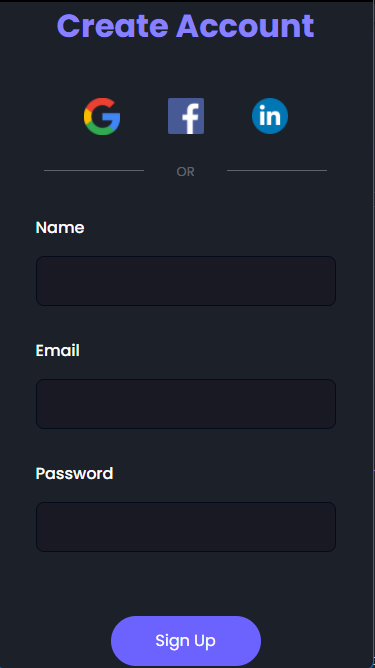

#  Projeto de uma página responsiva usando HTML e CSS 

- Esse projeto foi desenvolvido como parte dos meus estudos sobre HTML e CSS
- Foi criada uma página responsiva que se adapta a diferentes tamanhos de tela

---

## Conhecimentos aplicados 📚
- Box Model
- Responsividade
- Formatação de textos
- Grouping Tags
- Aplicação de IDs, classes, pseudoclasses e pseudoelementos em CSS
- Utilização de imagens
- Estilos em CSS
- Media query

## Resultado em uma tela de notebook 💻

  

## Resultado em uma tela de um smartphone 📱

  

