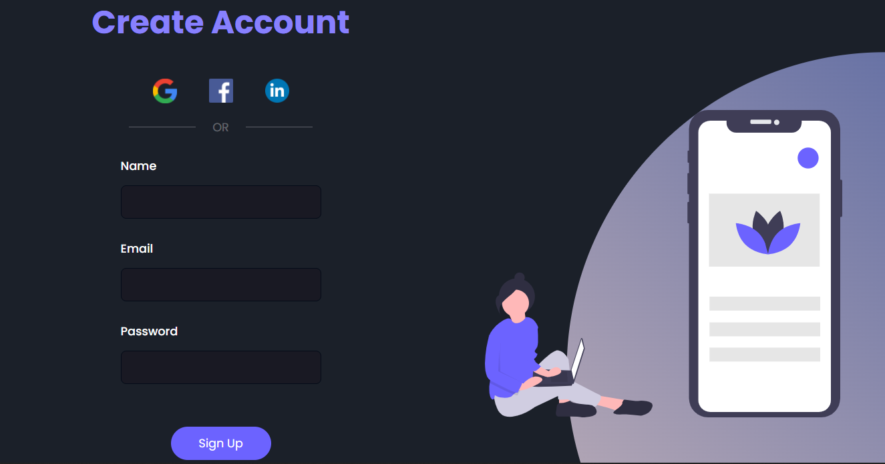

#  Projeto de uma página responsiva usando HTML e CSS 

 
 <h2>Clique aqui para visualizar o projeto</h2>

<table border="0.5">
  <tr>
    <td>
      Esse projeto foi desenvolvido como parte dos meus estudos sobre HTML e CSS
    </td>
    <td>
      Foi criada uma página responsiva que se adapta a diferentes tamanhos de tela
    </td>
  </tr>
</table>

## Conhecimentos aplicados 📚
- Box Model
- Responsividade
- Formatação de textos
- Grouping Tags
- Aplicação de IDs, classes, pseudoclasses e pseudoelementos em CSS
- Utilização de imagens
- Estilos em CSS
- Media query

## Resultado em uma tela de notebook 💻

  

## Resultado em uma tela de um smartphone 📱

  

